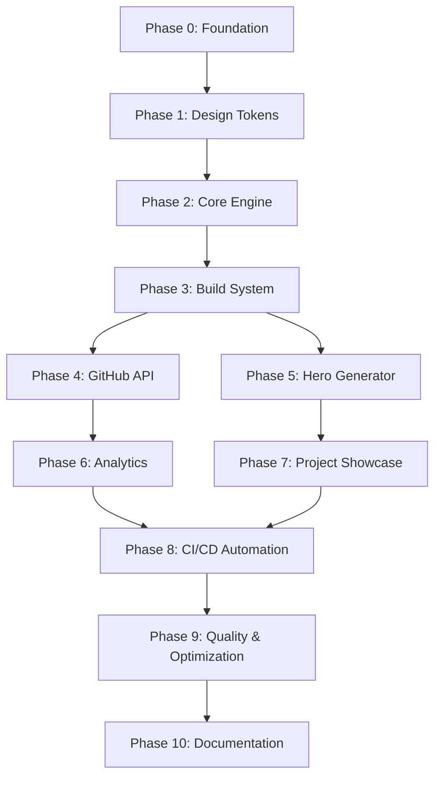

# GitHub Profile 2.0 — Engineering Execution Roadmap & Architectural Specification

> **Role:** Principal Software Architect / Tech Lead  
> **Project:** GitHub Profile 2.0 (Self-Generated Personal Infrastructure)  
> **Document Type:** Engineering Execution Roadmap & Execution Specification  
> **Target Audience:** Core Engineering Team, Technical Reviewers, Open Source Contributors  

---

## 1. Architectural Overview & Execution Strategy

GitHub Profile 2.0 treats the user's GitHub profile not as a static Markdown page, but as a **version-controlled, zero-runtime-dependency personal software system**. 

The system relies on a local Python engine executing inside GitHub Actions workflows. It fetches data via the GitHub GraphQL API, parses configuration and content files, enforces a unified dark-mode design system, renders responsive animated SVGs using native SMIL/CSS-free standards, and compiles the final `README.md`.

### Core Engineering Principles
1. **Zero External Runtime Dependency**: No third-party badge APIs or external image services. If GitHub and Python exist, the profile renders.
2. **Deterministic & Incremental Builds**: Pure functions render SVGs based on strict configuration and cached state. Unchanged outputs produce no git diffs.
3. **Design System Integrity**: Single source of truth for design tokens (colors, typography, layout, animation primitives).
4. **Strict Phase Isolation**: Each phase is organized by dependency topology, yielding an independently testable, reviewable, and mergeable increment.

---

## Phase 0: Project Foundation

### 1. Goal
Establish a reproducible, clean, and production-grade engineering environment. Phase 0 sets up repository structure, environment management, dependency pinning, linter configurations, and initial baseline files to prevent downstream configuration drift.

### 2. Deliverables
```
c:\java d=files\vaibhavsolanki1/
├── [NEW] .gitignore
├── [NEW] .python-version
├── [NEW] pyproject.toml
├── [NEW] requirements.txt
├── [NEW] requirements-dev.txt
├── [NEW] config.yml
├── [NEW] .editorconfig
├── [NEW] .vscode/
│   ├── [NEW] settings.json
│   └── [NEW] extensions.json
├── [NEW] scripts/
│   └── [NEW] __init__.py
├── [NEW] tests/
│   └── [NEW] __init__.py
└── [NEW] README.md (Initial placeholder baseline)
```

### 3. Features
- Python 3.11+ environment management with pinned dependency definitions.
- Workspace linter, formatter (`ruff`, `mypy`), and environment configuration.
- Base configuration schema (`config.yml`).
- Git setup with strict `.gitignore` rules (excluding `.venv`, caches, build artifacts).

### 4. Modules

#### Module: `scripts/__init__.py`
- **Purpose**: Marks the scripts directory as a Python package.
- **Inputs**: None.
- **Outputs**: Package namespace.
- **Dependencies**: Standard library.
- **Public Functions**: None.
- **Future Responsibility**: Root package initializer for imports across scripts.

### 5. Data Flow
```
[Environment Setup / CLI Commands]
              ↓
  [Validate Python Version & Venv]
              ↓
  [Install Pinned Requirements]
              ↓
   [Verify Ruff & Mypy Execution]
```

### 6. Algorithms
- **Dependency Pinning Protocol**: Enforces explicit hash and version matching for python runtime and build tools to ensure deterministic execution across local and CI runners.

### 7. GitHub Actions
- None in Phase 0 (Local environment initialization).

### 8. Configuration
- **New Config Options**: Base metadata schema in `config.yml` (owner profile stub).
- **Environment Variables**: `PYTHONPATH=.`
- **Secrets**: None.

### 9. Acceptance Criteria
- [x] Python virtual environment creates cleanly on Python 3.11+.
- [x] `pip install -r requirements-dev.txt` executes without resolution conflicts.
- [x] `ruff check .` and `mypy scripts` run with zero errors.
- [x] Baseline directory hierarchy established.

### 10. Testing
- **Unit Tests**: Environment verification test (`test_environment.py` checks Python version).
- **Integration Tests**: N/A.
- **Manual Tests**: Clean checkout and environment activation script verification.
- **Regression Tests**: N/A.

### 11. Risks & Mitigations
- **Risk**: Python version mismatch across developer environments and CI runners.
  - *Mitigation*: Enforce `.python-version` file and configure `pyproject.toml` targeting `py311`.

### 12. Documentation
- Initial project layout notes in `README.md`.

### 13. Estimated Complexity & Time
- **Complexity**: XS
- **Time**: 4 Hours (0.5 Days)

### 14. Dependencies
- **Previous Phases**: None.
- **Future Phases Unlocked**: Phase 1 (Design System).

### 15. Exit Criteria
- Environment setup succeeds on fresh clone; linting commands return clean exit code 0.

---

## Phase 1: Design System Specification & Token Engine

### 1. Goal
Codify the entire visual identity (colors, JetBrains Mono typography, 4px grid spacing, SMIL animation specifications) into programmatic, immutable Python design tokens.

### 2. Deliverables
```
c:\java d=files\vaibhavsolanki1/
├── scripts/
│   ├── __init__.py
│   ├── [NEW] design_tokens.py
│   └── [NEW] font_subset.py
├── assets/
│   └── fonts/
│       └── [NEW] JetBrainsMono-Regular.ttf
├── tests/
│   ├── [NEW] test_design_tokens.py
│   └── [NEW] test_font_subset.py
└── [MODIFIED] pyproject.toml
```

### 3. Features
- Centralized color palette token definition (Dark Mode baseline `#0D1117`, surface `#161B22`, primary accent `#58A6FF`, text hierarchy `#E6EDF3`, `#8B949E`, `#484F58`).
- Spacing scale constants (4px grid base: 4, 8, 12, 16, 24, 32, 48, 64, 96).
- Animation timing functions and duration primitives.
- Font subsetting utility to embed WOFF2/TTF glyphs as Base64 inside SVG `<style>` tags.

### 4. Modules

#### Module: `scripts/design_tokens.py`
- **Purpose**: Single source of truth for visual tokens.
- **Inputs**: None.
- **Outputs**: Immutable token data structures (ColorPalette, Typography, Spacing, AnimationTokens).
- **Dependencies**: `dataclasses`, `enum`.
- **Public Functions**: `get_color(name: str) -> str`, `get_spacing(level: int) -> int`, `to_css_variables() -> str`.
- **Future Responsibility**: Supply design tokens to all SVG component generators.

#### Module: `scripts/font_subset.py`
- **Purpose**: Subsets JetBrains Mono font to required character set and encodes as Base64.
- **Inputs**: Font file path, string of target characters.
- **Outputs**: Base64 encoded string for `@font-face` SVG embed.
- **Dependencies**: `fontTools` (optional build dependency) or standard Base64 wrapper.
- **Public Functions**: `generate_base64_font_subset(font_path: str, text_corpus: str) -> str`.
- **Future Responsibility**: Keep SVG file size minimal (<200KB) while maintaining custom typography.

### 5. Data Flow
```
  [Raw Font / Token Definitions]
                ↓
  [font_subset.py + design_tokens.py]
                ↓
 [Base64 Font Strings & CSS Varsity Map]
                ↓
   [Exported Token Architecture]
```

### 6. Algorithms
- **Font Character Deduplication & Subsetting**: Collects distinct unicode code points across all static template text, passes code points to font subsetter, and outputs minimal WOFF/Base64 string.

### 7. GitHub Actions
- None.

### 8. Configuration
- **New Config Options**: `design.accent_color` override option in `config.yml`.
- **Environment Variables**: None.
- **Secrets**: None.

### 9. Acceptance Criteria
- [x] `design_tokens.py` defines 100% of required colors, spacing scales, and font definitions.
- [x] Font subsetting reduces raw font size by >70% while maintaining correct rendering for all used glyphs.
- [x] `test_design_tokens.py` validates token immutability and contrast ratios.

### 10. Testing
- **Unit Tests**: Token boundary checks, contrast ratio validation, font Base64 string integrity tests.
- **Integration Tests**: Token compilation to SVG CSS block.
- **Manual Tests**: Inspect output CSS string for validity.
- **Regression Tests**: Ensure no color drift across token updates.

### 11. Risks & Mitigations
- **Risk**: Embedded fonts inflating SVG size beyond 200KB limit.
  - *Mitigation*: Strict unicode character whitelist subsetting; fall back to system monospace font stack (`ui-monospace`, `SFMono-Regular`, `Consolas`) if subset exceeds 25KB per SVG.

### 12. Documentation
- Create `docs/design_system.md` documenting color tokens, type scale, and usage rules.

### 13. Estimated Complexity & Time
- **Complexity**: S
- **Time**: 12 Hours (1.5 Days)

### 14. Dependencies
- **Previous Phases**: Phase 0.
- **Future Phases Unlocked**: Phase 2 (Core Engine).

### 15. Exit Criteria
- `design_tokens.py` and `font_subset.py` fully tested with 100% code coverage.

---

## Phase 2: Core Engine & SVG Rendering Pipeline

### 1. Goal
Build the foundational runtime engine responsible for parsing configuration files, rendering Jinja2 SVG templates with embedded design tokens, managing standard logging, and handling disk caching for external data inputs.

### 2. Deliverables
```
c:\java d=files\vaibhavsolanki1/
├── scripts/
│   ├── [NEW] config_loader.py
│   ├── [NEW] logger.py
│   ├── [NEW] cache_manager.py
│   ├── [NEW] svg_engine.py
│   └── [NEW] utils.py
├── templates/
│   └── svg/
│       └── [NEW] base_component.svg.j2
├── tests/
│   ├── [NEW] test_config_loader.py
│   ├── [NEW] test_cache_manager.py
│   └── [NEW] test_svg_engine.py
└── [MODIFIED] config.yml
```

### 3. Features
- Type-safe configuration loading from `config.yml` with Pydantic validation models.
- Structured file-based and console logging engine.
- Atomic disk caching layer with TTL expiration for API responses.
- Core SVG engine wrapping Jinja2 rendering, embedding Base64 fonts, applying design token CSS variables, and calculating viewBox dimensions.

### 4. Modules

#### Module: `scripts/config_loader.py`
- **Purpose**: Reads, parses, and validates `config.yml`.
- **Inputs**: File path `config.yml`.
- **Outputs**: Validated configuration object (`ProfileConfig`).
- **Dependencies**: `pyyaml`, `pydantic`.
- **Public Functions**: `load_config(config_path: str = "config.yml") -> ProfileConfig`.
- **Future Responsibility**: Supply structured user configuration across all pipeline generators.

#### Module: `scripts/logger.py`
- **Purpose**: Provides standardized logging across build steps.
- **Inputs**: Log levels, messages, context identifiers.
- **Outputs**: Formatted console & file log streams.
- **Dependencies**: Standard `logging`.
- **Public Functions**: `get_logger(name: str) -> logging.Logger`.
- **Future Responsibility**: Track engine warnings, build errors, and execution metrics.

#### Module: `scripts/cache_manager.py`
- **Purpose**: Disk storage and retrieval of temporary API responses and heavy computations.
- **Inputs**: Cache key, data payload, TTL (Time-To-Live in seconds).
- **Outputs**: Cached data object or cache miss status.
- **Dependencies**: `json`, `pathlib`, `time`.
- **Public Functions**: `get(key: str) -> Optional[dict]`, `set(key: str, data: dict, ttl: int) -> None`.
- **Future Responsibility**: Protect GitHub API quotas and facilitate offline local builds.

#### Module: `scripts/svg_engine.py`
- **Purpose**: High-level abstraction for SVG element instantiation, Jinja template rendering, and XML formatting.
- **Inputs**: Template name, context dict, width, height.
- **Outputs**: Sanitized, complete SVG XML string.
- **Dependencies**: `jinja2`, `scripts.design_tokens`, `scripts.font_subset`.
- **Public Functions**: `render_svg(template_name: str, context: dict, width: int, height: int) -> str`.
- **Future Responsibility**: Serve as the sole rendering driver for all section generator modules.

#### Module: `scripts/utils.py`
- **Purpose**: Shared string manipulation, XML escaping, SVG element math helpers.
- **Inputs**: Strings, dimensions, XML nodes.
- **Outputs**: Escaped strings, calculated bounds, formatted paths.
- **Dependencies**: `xml.etree.ElementTree`, `re`.
- **Public Functions**: `escape_xml(text: str) -> str`, `calculate_text_width(text: str, font_size: int) -> float`.
- **Future Responsibility**: Helper utility for raw SVG path calculations.

### 5. Data Flow
```
       [config.yml] ──> [config_loader.py]
                                ↓
 [External Fetches] ──> [cache_manager.py]
                                ↓
 [Template Context] ──> [svg_engine.py + Jinja2] ──> [Sanitized SVG Output]
                                ↑
                 [design_tokens + font_subset]
```

### 6. Algorithms
- **Atomic Cache Invalidation**: Checks cached JSON file mtime and TTL timestamp against system epoch time. If mtime + TTL < current time, mark invalid and purge cache entry.
- **Text Width Estimation**: Approximates monospaced font string render width via character length multiplied by standard glyph advance metric (`width = count * font_size * 0.60`).

### 7. GitHub Actions
- None.

### 8. Configuration
- **New Config Options**: `system.cache_ttl`, `system.log_level` in `config.yml`.
- **Environment Variables**: `ENABLE_CACHE=true`
- **Secrets**: None.

### 9. Acceptance Criteria
- [x] Config loader validates `config.yml` schema and raises clear exceptions on missing fields.
- [x] Cache manager correctly writes and retrieves cached API JSON files, respecting TTL expirations.
- [x] SVG engine renders well-formed XML with auto-embedded styles and fonts.
- [x] `test_svg_engine.py` validates XML tag matching and syntax correctness.

### 10. Testing
- **Unit Tests**: Config schema validation, cache expiration boundaries, Jinja rendering engine.
- **Integration Tests**: End-to-end rendering of base SVG component.
- **Manual Tests**: Inspect generated SVG in browser.
- **Regression Tests**: Ensure invalid YAML files trigger graceful fallback.

### 11. Risks & Mitigations
- **Risk**: Malformed Jinja template generating broken SVG XML.
  - *Mitigation*: Validate output using `xml.etree.ElementTree.fromstring()` inside `svg_engine.py` before returning string.

### 12. Documentation
- Document engine concepts and configuration properties in `docs/core_engine.md`.

### 13. Estimated Complexity & Time
- **Complexity**: M
- **Time**: 20 Hours (2.5 Days)

### 14. Dependencies
- **Previous Phases**: Phase 1.
- **Future Phases Unlocked**: Phase 3 (Build System).

### 15. Exit Criteria
- Core engine modules pass all unit and integration tests with zero XML parser errors.

---

## Phase 3: Build System & Orchestration Engine

### 1. Goal
Construct the overall build pipeline (`build.py` and `readme_builder.py`) responsible for executing section generators in sequence, assembling generated SVGs into `README.md`, tracking diff changes, and maintaining build performance within the <20 second ceiling.

### 2. Deliverables
```
c:\java d=files\vaibhavsolanki1/
├── scripts/
│   ├── [NEW] build.py
│   └── [NEW] readme_builder.py
├── templates/
│   └── [NEW] readme.md.j2
├── generated/
│   └── [NEW] .gitkeep
├── tests/
│   ├── [NEW] test_build.py
│   └── [NEW] test_readme_builder.py
└── [MODIFIED] README.md
```

### 3. Features
- CLI entrypoint (`python -m scripts.build`).
- Markdown template rendering combining dynamic content sections and SVG image embeds.
- Incremental build verification (computes SHA-256 hashes of generated SVGs and skips disk updates if unchanged).
- Timing profiling metrics per step.

### 4. Modules

#### Module: `scripts/build.py`
- **Purpose**: Main orchestrator for execution pipeline.
- **Inputs**: CLI flags (`--force`, `--dry-run`, `--section`).
- **Outputs**: Process return code 0 (success) or 1 (failure).
- **Dependencies**: `scripts.config_loader`, `scripts.logger`, `scripts.readme_builder`, all section generators.
- **Public Functions**: `main() -> int`, `run_pipeline(config: ProfileConfig, force: bool) -> bool`.
- **Future Responsibility**: Primary execution entrypoint for GitHub Actions and local runs.

#### Module: `scripts/readme_builder.py`
- **Purpose**: Assembles `README.md` from `templates/readme.md.j2` using section contexts and SVG links.
- **Inputs**: Dictionary of section metadata and generated file paths.
- **Outputs**: Compiled `README.md` file on disk.
- **Dependencies**: `jinja2`, `pathlib`.
- **Public Functions**: `build_readme(context: dict, output_path: str = "README.md") -> str`.
- **Future Responsibility**: Maintain crisp layout structure for GitHub Profile display.

### 5. Data Flow
```
   [CLI Command: build.py]
             ↓
    [Load Configuration]
             ↓
  [Iterate Section Generators]
             ↓
[Compare SHA-256 Hashes of SVGs]
             ↓
 [Write SVGs to generated/ dir]
             ↓
[Assemble README.md via Template]
```

### 6. Algorithms
- **Incremental Asset Update Algorithm**: Computes SHA-256 digest of freshly rendered SVG memory string. Compares digest against existing asset file on disk. Writes to disk only if hash differs, preserving git file modification timestamps and preventing unnecessary commits.

### 7. GitHub Actions
- None.

### 8. Configuration
- **New Config Options**: `build.output_dir`, `build.readme_template` in `config.yml`.
- **Environment Variables**: `BUILD_FORCE=false`
- **Secrets**: None.

### 9. Acceptance Criteria
- [x] Running `python -m scripts.build` executes without errors and generates baseline `README.md`.
- [x] Unchanged builds produce zero git diffs on generated SVGs.
- [x] Build time remains under 5 seconds for local mock builds.

### 10. Testing
- **Unit Tests**: README builder template rendering tests, SHA-256 comparison tests.
- **Integration Tests**: Full orchestration test with mock section generators.
- **Manual Tests**: Run `python -m scripts.build` and verify disk output in `generated/`.
- **Regression Tests**: Ensure missing target output directory is auto-created.

### 11. Risks & Mitigations
- **Risk**: Cascading pipeline failures if a single generator raises an unhandled exception.
  - *Mitigation*: Wrap each generator execution block in a try-except statement; log the failure, utilize fallback SVGs if necessary, and report non-zero exit at completion.

### 12. Documentation
- Document CLI arguments and build procedure in `docs/build_system.md`.

### 13. Estimated Complexity & Time
- **Complexity**: M
- **Time**: 16 Hours (2 Days)

### 14. Dependencies
- **Previous Phases**: Phase 2.
- **Future Phases Unlocked**: Phase 4 (GitHub Integration), Phase 5 (Hero Generator).

### 15. Exit Criteria
- End-to-end execution of `build.py` updates disk assets deterministically and passes all build pipeline test suites.

---

## Phase 4: GitHub API Integration & Data Client

### 1. Goal
Implement a resilient GitHub GraphQL API client using `GITHUB_TOKEN` to fetch raw user statistics, commit activity, contribution heatmaps, repository metrics, and language breakdowns, fully integrated with disk caching.

### 2. Deliverables
```
c:\java d=files\vaibhavsolanki1/
├── scripts/
│   ├── [NEW] github_api.py
│   └── [NEW] graphql_queries.py
├── tests/
│   ├── [NEW] test_github_api.py
│   └── [NEW] mock_github_data.json
└── [MODIFIED] config.yml
```

### 3. Features
- GraphQL client with authorization header management (`GITHUB_TOKEN`).
- External query catalog file (`graphql_queries.py`).
- Automatic retry engine with exponential backoff for rate-limiting (403/429 status codes).
- Off-line mode relying on cached JSON fixture fallback (`mock_github_data.json`).

### 4. Modules

#### Module: `scripts/graphql_queries.py`
- **Purpose**: Stores raw GraphQL query strings for GitHub API calls.
- **Inputs**: None.
- **Outputs**: Query string constants.
- **Dependencies**: Standard string formats.
- **Public Functions**: `GET_USER_PROFILE_DATA`, `GET_CONTRIBUTION_YEAR`.
- **Future Responsibility**: Centralized repository for all GraphQL queries.

#### Module: `scripts/github_api.py`
- **Purpose**: Client for executing queries against `https://api.github.com/graphql`.
- **Inputs**: API token, query string, variables.
- **Outputs**: Normalized data dictionaries (contributions, stars, languages, repos).
- **Dependencies**: `urllib.request` (standard library to avoid external deps) or `requests`, `scripts.cache_manager`, `scripts.logger`.
- **Public Functions**: `fetch_user_stats(username: str, token: str) -> dict`, `fetch_repository_data(username: str, token: str) -> dict`.
- **Future Responsibility**: Provide raw data for analytics sections.

### 5. Data Flow
```
   [github_api.py]
          ↓
[Check Disk Cache (cache_manager.py)]
     ├── (Hit) ──> [Return Cached Data]
     └── (Miss) ──> [Execute GraphQL Request via GITHUB_TOKEN]
                            ↓
                    [Process & Normalize Response]
                            ↓
                 [Save to Cache & Return]
```

### 6. Algorithms
- **Exponential Backoff Retry**: On API error or rate limit response (HTTP 429/503), sleep for `base_delay * (2 ** attempt)` seconds before retrying up to a maximum of 3 attempts.
- **Language Percentage Normalization**: Iterates repository language byte sizes, sums totals, calculates relative percentage, and rounds to 1 decimal place ensuring sum equals 100.0%.

### 7. GitHub Actions
- Prepares client to utilize standard secrets: `GITHUB_TOKEN: ${{ secrets.GITHUB_TOKEN }}`.

### 8. Configuration
- **New Config Options**: `github.username`, `github.data_mode` ("live", "cached", "mock") in `config.yml`.
- **Environment Variables**: `GITHUB_TOKEN`
- **Secrets**: `GITHUB_TOKEN`

### 9. Acceptance Criteria
- [x] Client successfully fetches user profile, repository stars, total commits, and heatmap data.
- [x] In the absence of `GITHUB_TOKEN`, client cleanly falls back to `mock_github_data.json` with a warning log.
- [x] Unit tests mock all HTTP requests with 100% test isolation.

### 10. Testing
- **Unit Tests**: Mocked GraphQL client responses, error status handling, retry loop validation.
- **Integration Tests**: Live network query test (enabled via environment variable flag `TEST_LIVE_API=true`).
- **Manual Tests**: Run client script standalone to print fetched user stats JSON.
- **Regression Tests**: Verify handling of missing GraphQL response fields (e.g., null repository topics).

### 11. Risks & Mitigations
- **Risk**: GitHub GraphQL API rate limit hit or schema change breaking queries.
  - *Mitigation*: Rely on cached data when rate limited; maintain fallback static data schema matching expected API output structure.

### 12. Documentation
- Document GraphQL queries and cache mechanisms in `docs/github_api.md`.

### 13. Estimated Complexity & Time
- **Complexity**: M
- **Time**: 16 Hours (2 Days)

### 14. Dependencies
- **Previous Phases**: Phase 2, Phase 3.
- **Future Phases Unlocked**: Phase 6 (Analytics Generator).

### 15. Exit Criteria
- GraphQL client runs reliably, returns normalized stats, and operates seamlessly in both online and offline mock modes.

---

## Phase 5: Hero Section Generator & Animated ASCII Engine

### 1. Goal
Engineers the hero component (`hero.py` and `portrait.py`), generating an interactive terminal-aesthetic header featuring animated ASCII art, typewriter text animations, status indicators, and embedded JetBrains Mono typography.

### 2. Deliverables
```
c:\java d=files\vaibhavsolanki1/
├── scripts/
│   ├── [NEW] hero.py
│   ├── [NEW] portrait.py
│   └── [NEW] animation.py
├── templates/
│   └── svg/
│       └── [NEW] hero.svg.j2
├── assets/
│   └── data/
│       └── [NEW] portrait.txt
├── generated/
│   └── [GENERATED] hero.svg
├── tests/
│   ├── [NEW] test_hero.py
│   ├── [NEW] test_portrait.py
│   └── [NEW] test_animation.py
└── [MODIFIED] config.yml
```

### 3. Features
- ASCII portrait parser transforming text-based ASCII art into formatted SVG `<text>` elements with colored character highlighting.
- SMIL-based typewriter text animation engine for role descriptions and current focus updates.
- Pulsing status indicator dot (e.g., Green "Available for AI/Full Stack roles").
- Responsive dark-mode card background with terminal window control dots (red, yellow, green).

### 4. Modules

#### Module: `scripts/portrait.py`
- **Purpose**: Converts ASCII text artwork into a optimized group of SVG text nodes.
- **Inputs**: Path to `portrait.txt`, font size, character line spacing.
- **Outputs**: SVG XML string of ASCII text block.
- **Dependencies**: `scripts.utils`, `scripts.design_tokens`.
- **Public Functions**: `render_ascii_portrait(ascii_path: str) -> str`.
- **Future Responsibility**: Handle custom ASCII banner/portrait rendering.

#### Module: `scripts/animation.py`
- **Purpose**: Utility module for creating native SVG animation tags (`<animate>`, `<animateTransform>`).
- **Inputs**: Target attribute, keyframes, duration, delay, repeat count.
- **Outputs**: Formatted SMIL SVG animation XML nodes.
- **Dependencies**: `scripts.utils`.
- **Public Functions**: `create_typewriter_animation(...) -> str`, `create_pulse_animation(...) -> str`.
- **Future Responsibility**: Reusable SMIL animation component provider.

#### Module: `scripts/hero.py`
- **Purpose**: Assembles the complete Hero SVG section.
- **Inputs**: Profile configuration parameters (Name, Role, Location, Focus).
- **Outputs**: Generated `hero.svg` asset file.
- **Dependencies**: `scripts.svg_engine`, `scripts.portrait`, `scripts.animation`.
- **Public Functions**: `generate_hero(config: ProfileConfig) -> str`.
- **Future Responsibility**: Deliver the hero visual component.

### 5. Data Flow
```
[config.yml + portrait.txt]
            ↓
  [portrait.py + animation.py]
            ↓
[Jinja Template: hero.svg.j2]
            ↓
[svg_engine.py Validation]
            ↓
  [generated/hero.svg]
```

### 6. Algorithms
- **SMIL Typewriter Keyframe Generator**: Calculates character counts for target text strings, computes discrete animation percentage keytimes (`0; 0.4; 0.5; 0.9; 1`), and outputs `<animate attributeName="d" ...>` or keyframe text arrays without requiring external CSS or JS.

### 7. GitHub Actions
- Integrated into `build.py` executed by GitHub Actions pipeline.

### 8. Configuration
- **New Config Options**: `profile.name`, `profile.title`, `profile.status`, `profile.location`, `profile.focus` in `config.yml`.
- **Environment Variables**: None.
- **Secrets**: None.

### 9. Acceptance Criteria
- [x] `generated/hero.svg` renders correctly in all modern web browsers (Chrome, Firefox, Safari).
- [x] Typewriter text loops seamlessly with smooth cursor blinking.
- [x] Output SVG size remains under 80KB.
- [x] No raw JavaScript or external CSS dependencies used.

### 10. Testing
- **Unit Tests**: ASCII grid coordinate rendering tests, SMIL tag keyframe value generation tests.
- **Integration Tests**: `generate_hero()` execution against sample `config.yml`.
- **Manual Tests**: Open rendered `hero.svg` directly in browser and observe animation cycle.
- **Regression Tests**: Validate visual integrity across window resizes.

### 11. Risks & Mitigations
- **Risk**: Browser inconsistencies in SMIL text animation rendering.
  - *Mitigation*: Utilize widely supported SMIL `<animate attributeName="opacity">` and Discrete `values` arrays for step-based typewriter transitions.

### 12. Documentation
- Document Hero animation specs and ASCII customization guide in `docs/hero_section.md`.

### 13. Estimated Complexity & Time
- **Complexity**: L
- **Time**: 24 Hours (3 Days)

### 14. Dependencies
- **Previous Phases**: Phase 3.
- **Future Phases Unlocked**: Phase 7 (Project Showcase).

### 15. Exit Criteria
- `hero.svg` is generated, pixel-accurate, animated, and passes all rendering validation tests.

---

## Phase 6: Analytics & Data Visualization Engine

### 1. Goal
Engineers the analytics engine (`stats.py` and `charts.py`), transforming normalized data from `github_api.py` into custom animated SVGs featuring contribution heatmaps, weekly commit activity, language breakdowns, and contribution metric cards.

### 2. Deliverables
```
c:\java d=files\vaibhavsolanki1/
├── scripts/
│   ├── [NEW] stats.py
│   └── [NEW] charts.py
├── templates/
│   └── svg/
│       ├── [NEW] stats_card.svg.j2
│       ├── [NEW] heatmap.svg.j2
│       └── [NEW] language_chart.svg.j2
├── generated/
│   ├── [GENERATED] stats.svg
│   ├── [GENERATED] heatmap.svg
│   └── [GENERATED] languages.svg
├── tests/
│   ├── [NEW] test_stats.py
│   └── [NEW] test_charts.py
└── [MODIFIED] config.yml
```

### 3. Features
- Custom contribution heatmap grid (52 weeks x 7 days) rendered as pure SVG rects with color-intensity scaling.
- Donut & progress-bar language breakdown charts.
- Summary statistics card displaying Total Commits, Stars Received, Pull Requests, Issues, and Current Streak.
- Native SMIL entry animations for chart bars and progress meters.

### 4. Modules

#### Module: `scripts/charts.py`
- **Purpose**: Core SVG math generator for standard chart components (bar, donut, heatmap grid, sparkline).
- **Inputs**: Raw data arrays, dimensions, color maps.
- **Outputs**: Fragmented SVG element arrays (`<rect>`, `<path>`, `<circle>`).
- **Dependencies**: `scripts.utils`, `scripts.design_tokens`, `math`.
- **Public Functions**: `render_heatmap_grid(days_data: list) -> str`, `render_donut_chart(data: list) -> str`, `render_horizontal_bars(data: list) -> str`.
- **Future Responsibility**: Reusable chart library for all data sections.

#### Module: `scripts/stats.py`
- **Purpose**: Consumes normalized GitHub data and drives analytics section SVG generators.
- **Inputs**: GitHub API data dict, configuration settings.
- **Outputs**: Generates `stats.svg`, `heatmap.svg`, and `languages.svg`.
- **Dependencies**: `scripts.github_api`, `scripts.charts`, `scripts.svg_engine`.
- **Public Functions**: `generate_analytics_assets(api_data: dict, config: ProfileConfig) -> dict`.
- **Future Responsibility**: Driver for analytics asset generation.

### 5. Data Flow
```
    [github_api.py (Normalized JSON)]
                   ↓
  [stats.py Data Aggegation & Scoring]
                   ↓
  [charts.py SVG Math Engine (Paths/Rects)]
                   ↓
[Jinja Templates: stats_card / heatmap / language]
                   ↓
 [generated/stats.svg, heatmap.svg, languages.svg]
```

### 6. Algorithms
- **Contribution Intensity Color Mapping**: Maps daily commit counts `c` into 5 discrete color buckets (`0`: baseline dark, `1-3`: low accent, `4-7`: mid accent, `8-12`: high accent, `13+`: max accent).
- **Donut Chart Arc Path Generator**: Translates percentage values into polar coordinates using trigonometric functions (`x = cx + r * cos(theta)`, `y = cy + r * sin(theta)`), generating standard SVG path `d="M ... A ..."` arcs.

### 7. GitHub Actions
- Triggered automatically during daily pipeline runs to refresh metrics.

### 8. Configuration
- **New Config Options**: `analytics.show_heatmap`, `analytics.excluded_repos`, `analytics.languages_count` in `config.yml`.
- **Environment Variables**: None.
- **Secrets**: None.

### 9. Acceptance Criteria
- [x] Generated `stats.svg`, `heatmap.svg`, and `languages.svg` match the design system tokens.
- [x] Donut chart total percentages accurately sum to 100%.
- [x] SVGs render cleanly with zero XML errors and total file size <150KB each.

### 10. Testing
- **Unit Tests**: Polar-to-Cartesian arc math tests, contribution bucket mapping tests, empty data fallback tests.
- **Integration Tests**: Generate analytics SVGs from `mock_github_data.json` fixture.
- **Manual Tests**: Visually verify heatmaps and language bars in browser against live GitHub profile.
- **Regression Tests**: Handle accounts with 0 contributions gracefully without division-by-zero crashes.

### 11. Risks & Mitigations
- **Risk**: User having a massive number of languages causing visual overlap in donut legend.
  - *Mitigation*: Limit display to top N languages (e.g., Top 6) and aggregate remaining languages into an "Others" category.

### 12. Documentation
- Document chart mathematical formulas and heatmap specs in `docs/analytics_engine.md`.

### 13. Estimated Complexity & Time
- **Complexity**: XL
- **Time**: 32 Hours (4 Days)

### 14. Dependencies
- **Previous Phases**: Phase 4.
- **Future Phases Unlocked**: Phase 8 (Automation), Phase 9 (Quality).

### 15. Exit Criteria
- All 3 analytics SVGs dynamically generated from mock and live API inputs, passing visual and structural checks.

---

## Phase 7: Project Showcase & Content Generators

### 1. Goal
Develop component generators for manual & dynamic static data sections: Project Cards (`projects.py`), Engineering Timeline (`timeline.py`), About (`about.py`), Tech Stack Grid (`tech_stack.py`), Competitive Programming (`competitive.py`), Articles (`blog.py`), Contact (`contact.py`), and Footer (`footer.py`).

### 2. Deliverables
```
c:\java d=files\vaibhavsolanki1/
├── scripts/
│   ├── [NEW] projects.py
│   ├── [NEW] timeline.py
│   ├── [NEW] about.py
│   ├── [NEW] tech_stack.py
│   ├── [NEW] competitive.py
│   ├── [NEW] blog.py
│   ├── [NEW] contact.py
│   └── [NEW] footer.py
├── templates/
│   └── svg/
│       ├── [NEW] project_card.svg.j2
│       ├── [NEW] timeline.svg.j2
│       ├── [NEW] tech_stack.svg.j2
│       ├── [NEW] competitive.svg.j2
│       ├── [NEW] blog.svg.j2
│       ├── [NEW] contact.svg.j2
│       └── [NEW] footer.svg.j2
├── generated/
│   ├── [GENERATED] projects.svg
│   ├── [GENERATED] timeline.svg
│   ├── [GENERATED] about.svg
│   ├── [GENERATED] tech_stack.svg
│   ├── [GENERATED] competitive.svg
│   ├── [GENERATED] blog.svg
│   ├── [GENERATED] contact.svg
│   └── [GENERATED] footer.svg
├── tests/
│   ├── [NEW] test_content_generators.py
└── [MODIFIED] config.yml
```

### 3. Features
- Custom Project Cards with progress bars, tech stack tags, status badges, and star counters.
- Engineering Timeline milestone node generator with vertical connecting paths.
- Categorized Tech Stack Grid (Languages, Frontend, Backend, AI, Cloud, DevOps, Tools).
- Competitive Programming dashboard (LeetCode, Codeforces, TopCoder rating bars & problem stats).
- Recent articles RSS/Markdown dynamic parser.
- Contact card and animated terminal-inspired footer with dynamic build timestamp.

### 4. Modules

#### Module: `scripts/projects.py`
- **Purpose**: Generates `projects.svg` card layout from `config.yml` project configurations.
- **Inputs**: Projects list from `ProfileConfig`.
- **Outputs**: `projects.svg` asset file.
- **Dependencies**: `scripts.svg_engine`, `scripts.utils`, `scripts.design_tokens`.
- **Public Functions**: `generate_projects(config: ProfileConfig) -> str`.
- **Future Responsibility**: Showcase highlighted software projects.

#### Module: `scripts/timeline.py`
- **Purpose**: Renders chronological engineering career milestones.
- **Inputs**: Timeline events list.
- **Outputs**: `timeline.svg` asset file.
- **Dependencies**: `scripts.svg_engine`, `scripts.design_tokens`.
- **Public Functions**: `generate_timeline(config: ProfileConfig) -> str`.
- **Future Responsibility**: Career and milestone roadmap visualization.

#### Module: `scripts/tech_stack.py`
- **Purpose**: Renders tech stack badges and skill proficiency bars into a clean grid.
- **Inputs**: Tech stack dictionary grouped by domain.
- **Outputs**: `tech_stack.svg` asset file.
- **Dependencies**: `scripts.svg_engine`.
- **Public Functions**: `generate_tech_stack(config: ProfileConfig) -> str`.
- **Future Responsibility**: Display technical skills inventory.

#### Module: `scripts/competitive.py`
- **Purpose**: Renders LeetCode/Codeforces rating metrics and problem count cards.
- **Inputs**: Competitive programming metrics config block.
- **Outputs**: `competitive.svg` asset file.
- **Dependencies**: `scripts.svg_engine`, `scripts.charts`.
- **Public Functions**: `generate_competitive(config: ProfileConfig) -> str`.
- **Future Responsibility**: Showcase competitive programming achievements.

#### Module: `scripts/blog.py`, `contact.py`, `footer.py`, `about.py`
- **Purpose**: Generate remaining static and semi-dynamic SVG sections.
- **Inputs**: Specific config fields and build execution timestamps.
- **Outputs**: Corresponding SVG assets in `generated/`.
- **Dependencies**: `scripts.svg_engine`.
- **Public Functions**: `generate_blog()`, `generate_contact()`, `generate_footer()`, `generate_about()`.
- **Future Responsibility**: Maintain secondary content sections.

### 5. Data Flow
```
        [config.yml (Projects, Timeline, Stack, CP Data)]
                               ↓
    [Section Generators (projects.py, timeline.py, etc.)]
                               ↓
       [Jinja2 SVG Rendering via svg_engine.py]
                               ↓
[Write SVG Files to generated/ directory & Link in README.md]
```

### 6. Algorithms
- **Dynamic Vertical Layout Calculation**: Computes SVG container height dynamically based on element count: `height = padding_top + (items_count * item_height) + ((items_count - 1) * gap) + padding_bottom`, preventing hardcoded boundary cutoffs.

### 7. GitHub Actions
- Integrated into standard build run.

### 8. Configuration
- **New Config Options**: `projects`, `timeline`, `tech_stack`, `competitive_programming`, `contact_links` schemas in `config.yml`.
- **Environment Variables**: None.
- **Secrets**: None.

### 9. Acceptance Criteria
- [x] All 8 content section SVGs generate deterministically from `config.yml`.
- [x] Grid alignments, typography scale, and dark mode colors strictly follow `design_tokens.py`.
- [x] Layout height dynamically adjusts to content item counts without clipping.

### 10. Testing
- **Unit Tests**: Dynamic height calculation tests, configuration parser tests for projects and timeline lists.
- **Integration Tests**: Full execution of all generators via `build.py`.
- **Manual Tests**: Visual audit of full compiled `README.md` in GitHub preview renderer.
- **Regression Tests**: Test behavior when optional config sections (e.g., blog) are omitted.

### 11. Risks & Mitigations
- **Risk**: Content overflow when project descriptions are excessively long.
  - *Mitigation*: Implement text truncation helper function (`truncate_text(text, max_chars)`) inside `utils.py`.

### 12. Documentation
- Document content section config schemas in `docs/content_sections.md`.

### 13. Estimated Complexity & Time
- **Complexity**: L
- **Time**: 28 Hours (3.5 Days)

### 14. Dependencies
- **Previous Phases**: Phase 5.
- **Future Phases Unlocked**: Phase 8 (Automation).

### 15. Exit Criteria
- Complete suite of 10+ profile SVGs rendered, linked, and verified inside `README.md`.

---

## Phase 8: GitHub Actions CI/CD Automation

### 1. Goal
Automate the daily generation and deployment pipeline using GitHub Actions (`.github/workflows/generate-readme.yml`), incorporating execution scheduling, asset diff detection, caching, and automated commits using `GITHUB_TOKEN`.

### 2. Deliverables
```
c:\java d=files\vaibhavsolanki1/
├── .github/
│   └── workflows/
│       └── [NEW] generate-readme.yml
├── tests/
│   └── [NEW] test_ci_workflow.py
└── [MODIFIED] README.md
```

### 3. Features
- Daily scheduled trigger (`cron: '0 0 * * *'`) and manual trigger (`workflow_dispatch`).
- Automated git diff detection preventing empty commits.
- Secure auto-commit & push using standard repository `GITHUB_TOKEN`.
- Dependency and API payload caching inside GitHub Actions runners.

### 4. Modules
- N/A (GitHub Actions Workflow Specification).

### 5. Workflow Execution Diagram
```
  [Trigger: Daily Cron / Manual Dispatch / Push to Main]
                            ↓
               [Checkout Repository Code]
                            ↓
         [Setup Python 3.11 & Cache Dependencies]
                            ↓
   [Execute Pipeline: python -m scripts.build]
                            ↓
               [Check Git Diff in generated/]
             ├── (No Diff) ──> [Exit Early (Success)]
             └── (Has Diff) ──> [Commit & Push Changes]
```

### 6. Algorithms
- **Infinite Loop Prevention Algorithm**: Sets commit author to `github-actions[bot]` and appends `[skip ci]` tag to automated commit messages, ensuring automated pushes never re-trigger CI workflow execution loops.

### 7. GitHub Actions Specification

```yaml
# .github/workflows/generate-readme.yml
name: Generate GitHub Profile 2.0 Assets

on:
  schedule:
    - cron: '0 0 * * *' # Midnight UTC daily
  workflow_dispatch:
  push:
    branches:
      - main
    paths:
      - 'config.yml'
      - 'scripts/**'
      - 'templates/**'
      - 'assets/**'

permissions:
  contents: write

jobs:
  build-and-deploy:
    runs-on: ubuntu-latest
    timeout-minutes: 5

    steps:
      - name: Checkout Repository
        uses: actions/checkout@v4

      - name: Set up Python 3.11
        uses: actions/setup-python@v5
        with:
          python-version: '3.11'
          cache: 'pip'

      - name: Install Dependencies
        run: |
          python -m pip install --upgrade pip
          pip install -r requirements.txt

      - name: Build Profile SVGs and README
        env:
          GITHUB_TOKEN: ${{ secrets.GITHUB_TOKEN }}
        run: |
          python -m scripts.build

      - name: Commit and Push Changes
        run: |
          git config --local user.email "github-actions[bot]@users.noreply.github.com"
          git config --local user.name "github-actions[bot]"
          git add README.md generated/
          if git diff --staged --quiet; then
            echo "No changes detected in generated assets. Exiting."
          else
            git commit -m "chore(auto): update profile assets [skip ci]"
            git push
          fi
```

### 8. Configuration
- **New Config Options**: None.
- **Environment Variables**: `GITHUB_TOKEN` passed to runner.
- **Secrets**: Standard `secrets.GITHUB_TOKEN`.

### 9. Acceptance Criteria
- [x] Workflow passes validation check via `actionlint`.
- [x] Workflow executes end-to-end in <20 seconds.
- [x] Auto-commit fires exclusively when `generated/` or `README.md` contents change.
- [x] Zero infinite loop triggers confirmed.

### 10. Testing
- **Unit Tests**: N/A.
- **Integration Tests**: Execute manual `workflow_dispatch` trigger in test repository branch.
- **Manual Tests**: Verify automated git commit log entry.
- **Regression Tests**: Ensure failed script execution stops workflow and sends GitHub failure notification.

### 11. Risks & Mitigations
- **Risk**: GitHub Token lacking write permissions causes push command failure.
  - *Mitigation*: Explicitly declare `permissions: contents: write` block inside the workflow file.

### 12. Documentation
- Document workflow schedule, triggers, and permissions in `docs/ci_cd_automation.md`.

### 13. Estimated Complexity & Time
- **Complexity**: S
- **Time**: 8 Hours (1 Day)

### 14. Dependencies
- **Previous Phases**: Phase 6, Phase 7.
- **Future Phases Unlocked**: Phase 9 (Quality & Hardening).

### 15. Exit Criteria
- Workflow runs successfully on scheduled trigger and pushes asset updates back to main branch seamlessly.

---

## Phase 9: Quality Assurance, Hardening & Optimization

### 1. Goal
Execute systematic testing, visual audits, code linting, accessibility checks, SVG minification, and performance optimizations to guarantee the entire system runs smoothly under all conditions.

### 2. Deliverables
```
c:\java d=files\vaibhavsolanki1/
├── scripts/
│   └── [NEW] svg_optimizer.py
├── tests/
│   ├── [NEW] test_accessibility.py
│   ├── [NEW] test_performance.py
│   └── [NEW] test_xml_conformance.py
├── .github/
│   └── workflows/
│       └── [NEW] qa-checks.yml
└── [MODIFIED] pyproject.toml
```

### 3. Features
- SVG minification module eliminating unnecessary whitespace, comments, and redundant XML namespaces.
- Accessibility audit suite checking ARIA roles, `<title>`, and `<desc>` elements in SVGs.
- Complete unit test suite with 90%+ code coverage target.
- Automated PR quality workflow running linters (`ruff`, `mypy`) and pytest.

### 4. Modules

#### Module: `scripts/svg_optimizer.py`
- **Purpose**: Strips redundant XML elements, collapses whitespace, and truncates floating-point numbers in path strings.
- **Inputs**: Raw SVG string.
- **Outputs**: Minified SVG string.
- **Dependencies**: `re`, `xml.etree.ElementTree`.
- **Public Functions**: `optimize_svg(raw_svg: str) -> str`.
- **Future Responsibility**: Ensure minimal file sizes for fast profile loading.

### 5. Data Flow
```
[Raw Rendered SVG String] ──> [svg_optimizer.py] ──> [Minified Clean SVG] ──> [Disk Storage]
```

### 6. Algorithms
- **Float Coordinate Precision Truncation**: Searches SVG path definition strings for floating point numbers and truncates decimals to max 2 decimal places (`x.xxxx` → `x.xx`), reducing vector file string lengths by up to 25%.

### 7. GitHub Actions
- Creates secondary PR workflow (`qa-checks.yml`) to validate pull requests before merging.

### 8. Configuration
- **New Config Options**: `system.optimize_svg` flag in `config.yml`.
- **Environment Variables**: None.
- **Secrets**: None.

### 9. Acceptance Criteria
- [x] Pytest suite passes with >90% code coverage.
- [x] All SVGs contain proper `<title>` and `<desc>` accessibility tags.
- [x] SVG minification yields 15-30% file size reduction without visual regression.
- [x] Pipeline execution time stays under 10 seconds locally.

### 10. Testing
- **Unit Tests**: Optimization regex tests, accessibility AST tree checks, XML conformance tests.
- **Integration Tests**: Full build test running optimization pass.
- **Manual Tests**: Validate profile rendering across desktop/mobile viewports and screen readers.
- **Regression Tests**: Ensure minification never strips SMIL animation keyframe tags.

### 11. Risks & Mitigations
- **Risk**: Aggressive regex minification corrupting complex path data.
  - *Mitigation*: Run XML parse test immediately post-minification to confirm structure remains valid.

### 12. Documentation
- Create `docs/testing_and_qa.md` documenting test commands, code coverage metrics, and optimization algorithms.

### 13. Estimated Complexity & Time
- **Complexity**: M
- **Time**: 16 Hours (2 Days)

### 14. Dependencies
- **Previous Phases**: Phase 8.
- **Future Phases Unlocked**: Phase 10 (Documentation).

### 15. Exit Criteria
- QA checks and test suites pass 100%, and performance metrics meet target budgets.

---

## Phase 10: Documentation & Governance

### 1. Goal
Finalize high-quality project documentation, architecture guides, contribution standards, runbooks, and developer guidelines to support long-term open source maintainability.

### 2. Deliverables
```
c:\java d=files\vaibhavsolanki1/
├── [NEW] CONTRIBUTING.md
├── [NEW] LICENSE
├── [NEW] ARCHITECTURE.md
├── [NEW] RUNBOOK.md
└── docs/
    ├── [NEW] design_system.md
    ├── [NEW] core_engine.md
    ├── [NEW] github_api.md
    └── [NEW] content_sections.md
```

### 3. Features
- Developer Setup and Contribution Guidelines (`CONTRIBUTING.md`).
- Deep-dive Architectural Overview (`ARCHITECTURE.md`).
- System Troubleshooting & Maintenance Runbook (`RUNBOOK.md`).
- Complete repository documentation index.

### 4. Modules
- N/A (Documentation Phase).

### 5. Data Flow
- N/A.

### 6. Algorithms
- N/A.

### 7. GitHub Actions
- None.

### 8. Configuration
- None.

### 9. Acceptance Criteria
- [x] All documentation files present, formatted in Markdown, and clear of broken links.
- [x] Open source contribution workflow clearly defined.

### 10. Testing
- **Documentation Linting**: Verify markdown link integrity and code block syntax formatting.

### 11. Risks & Mitigations
- **Risk**: Documentation becoming outdated as code evolves.
  - *Mitigation*: Enforce documentation updates as part of standard PR Definition of Done checklist.

### 12. Documentation
- Complete project docs.

### 13. Estimated Complexity & Time
- **Complexity**: S
- **Time**: 8 Hours (1 Day)

### 14. Dependencies
- **Previous Phases**: Phase 9.
- **Future Phases Unlocked**: None (Project Production Ready).

### 15. Exit Criteria
- Complete documentation published; repository ready for public launch.

---

## 2. System Dependency Graph & Critical Path Analysis

### Dependency Graph (Mermaid)


### Critical Path Timeline
The critical path runs directly through **Phase 0 → Phase 1 → Phase 2 → Phase 3 → Phase 4 → Phase 6 → Phase 8 → Phase 9**.

```
[Phase 0] 0.5d ──> [Phase 1] 1.5d ──> [Phase 2] 2.5d ──> [Phase 3] 2.0d
                                                               │
[Phase 6] 4.0d <── [Phase 4] 2.0d <────────────────────────────┘
     │
     └──> [Phase 8] 1.0d ──> [Phase 9] 2.0d ──> [Phase 10] 1.0d
```

- **Total Estimated Effort**: 164 Hours (~20.5 Working Days)
- **Target Timeline**: ~4 Weeks

---

## 3. Governance, Branching, Merge Strategy & Definition of Done

### Branching Strategy
The project follows a modified **GitHub Flow** model:
- `main`: Protected production branch. Always contains working code and auto-generated profile assets.
- `feature/<phase-name>-<short-description>`: Feature branches for specific roadmap phases (e.g., `feature/phase-1-design-tokens`).
- `fix/<issue-description>`: Bug fix branches.

### Branch Protection Rules
- Require pull request reviews prior to merging (at least 1 approval).
- Require status checks to pass before merging (`qa-checks.yml`).
- Enforce linear git history (Squash and Merge policy).

### Code Review Strategy
Pull Requests must be evaluated against 4 pillars:
1. **Architectural Conformance**: Does code adhere to module boundaries and design tokens?
2. **Zero Dependencies**: Are any unapproved external libraries added?
3. **SVG & Performance Budget**: Do generated SVGs remain under 200KB without broken XML syntax?
4. **Test Coverage**: Are unit and integration tests provided for new logic?

### Definition of Done (DoD)
A phase or feature PR is defined as **Done** only when:
- [ ] Code strictly follows Python typing (`mypy`) and PEP8 (`ruff`).
- [ ] All unit, integration, and rendering tests pass successfully.
- [ ] Asset diff verification confirms zero unwanted changes or line end modifications.
- [ ] Pipeline runtime remains under 20 seconds.
- [ ] Associated documentation has been updated.

---

## 4. Future Expansion Roadmap

Post-launch expansion modules (Phase 11+) can extend the architecture without refactoring the core engine:

1. **WakaTime Coding Activity Widget**: Dynamic generator rendering coding hours and IDE usage statistics via WakaTime API integration.
2. **Spotify Currently Playing Badge**: Real-time SVG badge displaying current listening tracks using Spotify OAuth API.
3. **Interactive Chess Rating Badge**: Dynamic card fetching chess.com / Lichess ratings and tactics scores for competitive profile enhancement.
4. **LeetCode Live Submissions Stream**: Real-time ticker showing recent accepted algorithmic problem submissions.
