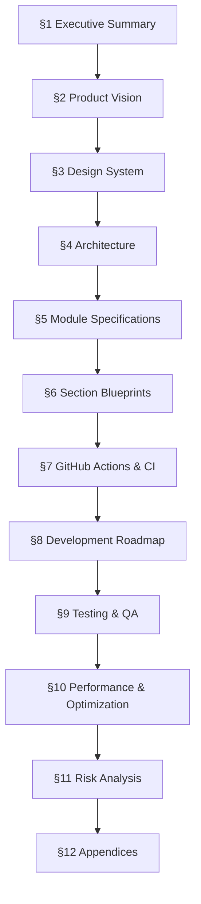

# GitHub Profile 2.0 — PRD Master Outline & Implementation Plan

> **Project:** Self-Generated GitHub Profile README  
> **Owner:** Vaibhav Solanki  
> **Document Type:** Product Requirements Document (PRD)  
> **Target Length:** 15,000+ words across all sections  
> **Format:** Professional software specification  

---

## Document Architecture

The PRD is divided into **12 major sections**, each self-contained but cross-referenced. They will be written in dependency order — foundational sections first, implementation sections last.



---

## Section Breakdown

### §1 — Executive Summary
> **Est. Length:** ~800 words | **Priority:** P0 | **Dependencies:** None

| Item | Detail |
|------|--------|
| **1.1** | Project Name & Codename |
| **1.2** | Problem Statement — Why existing GitHub profiles fail |
| **1.3** | Solution Overview — Self-generating profile as a product |
| **1.4** | Key Differentiators vs. third-party widget approach |
| **1.5** | Target Audience Matrix (Recruiters, OSS Maintainers, Hackathon Judges, Developers, Founders, ICPC Teams, AI Researchers) |
| **1.6** | Success Metrics & KPIs |
| **1.7** | Constraints & Non-Goals |
| **1.8** | Document Conventions |

---

### §2 — Product Vision & Brand Identity
> **Est. Length:** ~1,200 words | **Priority:** P0 | **Dependencies:** §1

| Item | Detail |
|------|--------|
| **2.1** | Mission Statement |
| **2.2** | Vision Statement |
| **2.3** | Design Philosophy — Apple HIG, Linear, Vercel, NASA Mission Control, Terminal Aesthetics |
| **2.4** | Brand Attributes — Minimal, Elegant, Technical, Modern, Premium, Confident |
| **2.5** | Owner Profile Specification (Name, Role, Identity Tags, Current Projects) |
| **2.6** | Tone of Voice Guidelines |
| **2.7** | Visual Identity Principles |
| **2.8** | Competitor Analysis — What top GitHub profiles do wrong |

---

### §3 — Design System Specification
> **Est. Length:** ~2,500 words | **Priority:** P0 | **Dependencies:** §2

This is the **most critical section** — every SVG, animation, and layout derives from this.

| Item | Detail |
|------|--------|
| **3.1** | **Color Palette** |
|  | 3.1.1 — Background hierarchy (`#0D1117`, `#161B22`, `#21262D`, `#30363D`) |
|  | 3.1.2 — Text hierarchy (Primary `#E6EDF3`, Secondary `#8B949E`, Muted `#484F58`) |
|  | 3.1.3 — Accent color system (Primary accent, hover, active, disabled states) |
|  | 3.1.4 — Semantic colors (Success, Warning, Error, Info) |
|  | 3.1.5 — Gradient specifications |
|  | 3.1.6 — Color usage rules & accessibility contrast ratios |
| **3.2** | **Typography** |
|  | 3.2.1 — Primary font: JetBrains Mono (embedding strategy for SVG) |
|  | 3.2.2 — Type scale (font sizes, line heights, letter spacing) |
|  | 3.2.3 — Font weight usage (Regular 400, Medium 500, Bold 700) |
|  | 3.2.4 — Font subsetting strategy for SVG embedding |
| **3.3** | **Spacing & Layout** |
|  | 3.3.1 — Base unit (4px grid) |
|  | 3.3.2 — Spacing scale (4, 8, 12, 16, 24, 32, 48, 64, 96) |
|  | 3.3.3 — SVG canvas dimensions & viewBox standards |
|  | 3.3.4 — Card layout system |
|  | 3.3.5 — Section spacing in README |
| **3.4** | **Component Library** |
|  | 3.4.1 — Card component (border, radius, shadow, padding) |
|  | 3.4.2 — Badge component |
|  | 3.4.3 — Progress bar component |
|  | 3.4.4 — Chart components (bar, line, heatmap, donut) |
|  | 3.4.5 — Icon system |
|  | 3.4.6 — Divider & separator styles |
| **3.5** | **Animation Principles** |
|  | 3.5.1 — Timing functions (ease-in-out, cubic-bezier specs) |
|  | 3.5.2 — Duration standards (fast 200ms, normal 400ms, slow 800ms) |
|  | 3.5.3 — Animation types (fade, slide, scale, draw, pulse, typewriter) |
|  | 3.5.4 — Stagger patterns |
|  | 3.5.5 — `prefers-reduced-motion` fallbacks |
| **3.6** | **SVG Standards** |
|  | 3.6.1 — File naming conventions |
|  | 3.6.2 — ViewBox & responsive sizing |
|  | 3.6.3 — Embedded font strategy |
|  | 3.6.4 — Animation implementation (SMIL only, no JS, no CSS) |
|  | 3.6.5 — Accessibility (ARIA labels, title, desc elements) |
|  | 3.6.6 — Size budget per SVG (<200KB) |
| **3.7** | **Markdown Standards** |
|  | 3.7.1 — Image embedding syntax |
|  | 3.7.2 — Section separator patterns |
|  | 3.7.3 — Alignment & centering rules |
|  | 3.7.4 — Dark/light mode considerations |

---

### §4 — System Architecture
> **Est. Length:** ~2,000 words | **Priority:** P0 | **Dependencies:** §3

| Item | Detail |
|------|--------|
| **4.1** | **High-Level Architecture Diagram** |
| **4.2** | **Repository Structure** |
|  | 4.2.1 — Complete folder tree with descriptions |
|  | 4.2.2 — File naming conventions |
|  | 4.2.3 — Generated vs. source files |
| **4.3** | **Data Flow** |
|  | 4.3.1 — GitHub Action trigger → Python scripts → SVG generation → README assembly → Commit |
|  | 4.3.2 — API data flow (GitHub GraphQL → JSON → SVG) |
|  | 4.3.3 — Static data flow (YAML config → Python → SVG) |
| **4.4** | **Configuration System** |
|  | 4.4.1 — `config.yml` schema (owner info, colors, projects, social links) |
|  | 4.4.2 — Environment variables |
|  | 4.4.3 — Secrets management |
| **4.5** | **Build Pipeline** |
|  | 4.5.1 — Build order & dependency graph between modules |
|  | 4.5.2 — Incremental build strategy |
|  | 4.5.3 — Error handling & fallback SVGs |
| **4.6** | **Technology Stack** |
|  | 4.6.1 — Python 3.11+ |
|  | 4.6.2 — Dependencies (minimal: `requests`, `pyyaml`, `jinja2`) |
|  | 4.6.3 — No heavy frameworks |

#### 4.2.1 — Complete Folder Tree (Preview)

```
vaibhavsolanki1/
├── README.md                          # Auto-generated — DO NOT EDIT
├── config.yml                         # All profile configuration
├── CONTRIBUTING.md
├── LICENSE
│
├── scripts/
│   ├── __init__.py
│   ├── build.py                       # Main orchestrator
│   ├── github_api.py                  # GitHub GraphQL client
│   ├── portrait.py                    # ASCII portrait generator
│   ├── stats.py                       # GitHub statistics processor
│   ├── charts.py                      # Chart/graph SVG generators
│   ├── animation.py                   # SVG animation utilities
│   ├── timeline.py                    # Timeline SVG generator
│   ├── projects.py                    # Project cards generator
│   ├── tech_stack.py                  # Tech stack SVG generator
│   ├── competitive.py                 # Competitive programming section
│   ├── blog.py                        # Blog/articles section
│   ├── contact.py                     # Contact section generator
│   ├── footer.py                      # Footer generator
│   ├── hero.py                        # Hero section generator
│   ├── about.py                       # About section generator
│   ├── font_subset.py                 # Font embedding utility
│   ├── readme_builder.py             # README.md assembler
│   ├── utils.py                       # Shared utilities
│   └── design_tokens.py              # Design system constants
│
├── templates/
│   ├── readme.md.j2                   # README Jinja2 template
│   ├── svg/
│   │   ├── hero.svg.j2
│   │   ├── stats_card.svg.j2
│   │   ├── heatmap.svg.j2
│   │   ├── language_chart.svg.j2
│   │   ├── project_card.svg.j2
│   │   ├── timeline.svg.j2
│   │   ├── tech_stack.svg.j2
│   │   ├── footer.svg.j2
│   │   └── components/
│   │       ├── card.svg.j2
│   │       ├── badge.svg.j2
│   │       ├── progress_bar.svg.j2
│   │       └── chart_base.svg.j2
│   └── partials/
│       ├── fonts.j2                   # Font embedding partial
│       └── animations.j2             # Common animation defs
│
├── assets/
│   ├── fonts/
│   │   └── JetBrainsMono-subset.woff2
│   └── data/
│       ├── portrait.txt               # ASCII art source
│       └── quotes.yml                 # Rotating quotes
│
├── generated/                         # All auto-generated files
│   ├── hero.svg
│   ├── about.svg
│   ├── stats.svg
│   ├── heatmap.svg
│   ├── languages.svg
│   ├── activity.svg
│   ├── projects.svg
│   ├── timeline.svg
│   ├── tech_stack.svg
│   ├── competitive.svg
│   ├── blog.svg
│   ├── contact.svg
│   ├── footer.svg
│   └── cache/
│       └── github_data.json           # Cached API responses
│
├── tests/
│   ├── test_build.py
│   ├── test_github_api.py
│   ├── test_svg_output.py
│   ├── test_charts.py
│   └── test_design_tokens.py
│
├── .github/
│   └── workflows/
│       └── generate-readme.yml
│
├── requirements.txt
├── pyproject.toml
└── .gitignore
```

---

### §5 — Python Module Specifications
> **Est. Length:** ~3,000 words | **Priority:** P0 | **Dependencies:** §4

Each module gets a full specification:

| Module | Responsibility | Key Functions | Input | Output |
|--------|---------------|---------------|-------|--------|
| **5.1** `design_tokens.py` | Design system constants | Colors, fonts, spacing, animation configs | None | Python constants |
| **5.2** `utils.py` | Shared SVG helpers | `create_svg_root()`, `embed_font()`, `add_animation()`, `sanitize()` | Various | SVG elements |
| **5.3** `font_subset.py` | Font embedding | `subset_font()`, `encode_base64()` | Font file + chars | Base64 string |
| **5.4** `github_api.py` | GitHub data fetching | `fetch_contributions()`, `fetch_repos()`, `fetch_languages()` | Token | JSON data |
| **5.5** `portrait.py` | ASCII portrait SVG | `generate_portrait()` | ASCII text | SVG file |
| **5.6** `hero.py` | Hero section | `generate_hero()` | Config | SVG file |
| **5.7** `about.py` | About section | `generate_about()` | Config | SVG file |
| **5.8** `stats.py` | Statistics processing | `process_stats()`, `generate_stats_card()` | API data | SVG file |
| **5.9** `charts.py` | Chart generation | `bar_chart()`, `heatmap()`, `donut()`, `line_chart()`, `sparkline()` | Data | SVG elements |
| **5.10** `animation.py` | Animation utilities | `typewriter()`, `fade_in()`, `draw_line()`, `pulse()`, `stagger()` | Params | SVG animation elements |
| **5.11** `timeline.py` | Timeline section | `generate_timeline()` | Config | SVG file |
| **5.12** `projects.py` | Project cards | `generate_projects()` | Config | SVG file |
| **5.13** `tech_stack.py` | Tech stack grid | `generate_tech_stack()` | Config | SVG file |
| **5.14** `competitive.py` | CP section | `generate_competitive()` | Config/API | SVG file |
| **5.15** `blog.py` | Articles section | `generate_blog()` | RSS/Config | SVG file |
| **5.16** `contact.py` | Contact section | `generate_contact()` | Config | SVG file |
| **5.17** `footer.py` | Footer | `generate_footer()` | Config | SVG file |
| **5.18** `readme_builder.py` | README assembly | `build_readme()` | All SVGs + template | README.md |
| **5.19** `build.py` | Main orchestrator | `main()` | Config + env | All outputs |

For each module, the PRD will specify:
- Purpose & responsibility
- Public API (function signatures with types)
- Algorithm pseudocode for complex functions
- Input/output contracts
- Error handling strategy
- Dependencies on other modules

---

### §6 — README Section Blueprints
> **Est. Length:** ~3,000 words | **Priority:** P1 | **Dependencies:** §3, §5

Detailed specification for each visual section of the README:

| Section | SVG? | Data Source | Animation | Est. SVG Size |
|---------|------|------------|-----------|---------------|
| **6.1** Hero | ✅ | Static config | Typewriter, cursor blink, fade-in | ~80KB |
| **6.2** About | ✅ | Static config | Fade-in, draw lines | ~40KB |
| **6.3** Projects | ✅ | Static config | Stagger fade, progress bars | ~100KB |
| **6.4** GitHub Analytics | ✅ | GraphQL API | Counter animation, heatmap draw | ~150KB |
| **6.5** Competitive Programming | ✅ | Static config | Bar chart draw, counter | ~60KB |
| **6.6** Tech Stack | ✅ | Static config | Grid fade-in | ~80KB |
| **6.7** Timeline | ✅ | Static config | Sequential reveal | ~70KB |
| **6.8** Latest Articles | ✅ | RSS/Static | Fade-in | ~40KB |
| **6.9** Contact | ✅ | Static config | Hover-ready links | ~30KB |
| **6.10** Footer | ✅ | Dynamic (timestamp) | Terminal typing | ~20KB |

For each section, the PRD will include:
- Visual mockup description (layout, spacing, elements)
- Data requirements
- SVG structure (element hierarchy)
- Animation sequence & timing
- Accessibility requirements
- Fallback behavior
- Responsive behavior

---

### §7 — GitHub Actions & CI/CD
> **Est. Length:** ~1,000 words | **Priority:** P1 | **Dependencies:** §4, §5

| Item | Detail |
|------|--------|
| **7.1** | Workflow file specification (`generate-readme.yml`) |
| **7.2** | Trigger conditions (schedule: daily, workflow_dispatch: manual) |
| **7.3** | Job steps (checkout → setup Python → install deps → run build → diff check → commit) |
| **7.4** | GITHUB_TOKEN permissions & scope |
| **7.5** | Caching strategy (pip cache, API response cache) |
| **7.6** | Infinite loop prevention (commit message filter) |
| **7.7** | Error handling & notification |
| **7.8** | Build time budget (<20 seconds) |
| **7.9** | Secrets management |

---

### §8 — Development Roadmap (10 Phases)
> **Est. Length:** ~3,500 words | **Priority:** P0 | **Dependencies:** §1–§7

Each phase includes all requested sub-items:

| Phase | Name | Duration | Dependencies |
|-------|------|----------|-------------|
| **Phase 1** | Design System Foundation | 2 days | None |
| **Phase 2** | Portrait & Hero Generator | 2 days | Phase 1 |
| **Phase 3** | SVG Animation Engine | 2 days | Phase 1 |
| **Phase 4** | GitHub GraphQL API Client | 1 day | Phase 1 |
| **Phase 5** | Analytics & Charts | 3 days | Phase 3, 4 |
| **Phase 6** | Timeline & About Sections | 1 day | Phase 3 |
| **Phase 7** | Project Cards & Tech Stack | 2 days | Phase 3 |
| **Phase 8** | Blog & Contact Sections | 1 day | Phase 3 |
| **Phase 9** | GitHub Actions Automation | 1 day | Phase 4, 5 |
| **Phase 10** | Optimization & Polish | 2 days | All |

For **each** phase, the PRD will document:

```
├── Objectives (what this phase achieves)
├── Features (what gets built)
├── Tasks (checklist of implementation steps)
├── Dependencies (what must be complete first)
├── Folder Changes (new files/directories created)
├── Python Files (modules created or modified)
├── Algorithms (key logic pseudocode)
├── Expected Output (what the phase produces)
├── Acceptance Criteria (how to verify completion)
├── Testing Strategy (unit + integration tests)
└── Future Improvements (stretch goals)
```

---

### §9 — Testing & Quality Assurance
> **Est. Length:** ~800 words | **Priority:** P1 | **Dependencies:** §5

| Item | Detail |
|------|--------|
| **9.1** | Unit testing strategy (pytest) |
| **9.2** | SVG validation (well-formed XML, correct viewBox, font embedding) |
| **9.3** | Visual regression testing approach |
| **9.4** | API mock strategy for offline testing |
| **9.5** | Size budget validation |
| **9.6** | Accessibility audit checklist |
| **9.7** | Cross-platform rendering tests (GitHub web, mobile, dark/light mode) |

---

### §10 — Performance & Optimization
> **Est. Length:** ~600 words | **Priority:** P2 | **Dependencies:** §5, §7

| Item | Detail |
|------|--------|
| **10.1** | SVG optimization (minification, path simplification) |
| **10.2** | Font subsetting (only used glyphs) |
| **10.3** | API response caching |
| **10.4** | Parallel SVG generation |
| **10.5** | GitHub Actions runtime optimization |
| **10.6** | Image loading performance on GitHub |

---

### §11 — Risk Analysis & Mitigation
> **Est. Length:** ~600 words | **Priority:** P1 | **Dependencies:** All

| Risk | Impact | Probability | Mitigation |
|------|--------|-------------|------------|
| GitHub API rate limiting | High | Medium | Caching, graceful fallback |
| SVG rendering inconsistencies | Medium | Medium | Cross-browser testing |
| SMIL animation deprecation | High | Low | CSS animation fallback layer |
| Font embedding failures | Medium | Low | System font fallback chain |
| GitHub Actions quota exhaustion | Low | Low | Daily-only schedule |
| README breaking on mobile | Medium | Medium | Responsive SVG design |

---

### §12 — Appendices
> **Est. Length:** ~1,000 words | **Priority:** P2 | **Dependencies:** All

| Item | Detail |
|------|--------|
| **A** | Complete `config.yml` schema reference |
| **B** | GitHub GraphQL query library |
| **C** | SVG animation cookbook (code snippets) |
| **D** | Color palette visual reference |
| **E** | Contribution guidelines |
| **F** | Versioning strategy (SemVer for generated assets) |
| **G** | Maintenance strategy & runbook |
| **H** | Future expansion ideas (Spotify integration, WakaTime, etc.) |
| **I** | Glossary of terms |

---

## Implementation Plan — Writing Order

The PRD will be written in **4 sequential batches** to manage complexity:

### Batch 1 — Foundation (§1 + §2 + §3)
> ~4,500 words

- Executive summary, vision, and the complete design system
- This establishes the visual language everything else references
- **No code dependencies** — pure specification

### Batch 2 — Architecture & Modules (§4 + §5)
> ~5,000 words

- System architecture, folder structure, data flow
- Full module specifications with function signatures and algorithms
- **Depends on:** Design system tokens from §3

### Batch 3 — Sections & Roadmap (§6 + §7 + §8)
> ~7,500 words

- Every README section blueprint with visual specs
- GitHub Actions workflow specification
- Complete 10-phase development roadmap with all sub-items
- **Depends on:** Module specs from §5

### Batch 4 — Quality & Appendices (§9 + §10 + §11 + §12)
> ~3,000 words

- Testing, performance, risks, and reference material
- **Depends on:** Everything above

---

## Estimated Totals

| Metric | Value |
|--------|-------|
| **Total Sections** | 12 |
| **Total Sub-sections** | ~95 |
| **Estimated Word Count** | 18,000–20,000 |
| **Writing Batches** | 4 |
| **Diagrams** | 8+ (Mermaid) |
| **Tables** | 30+ |
| **Code Samples** | 15+ |

---

## Decision Points for Review

> [!IMPORTANT]
> Before writing the full PRD, please confirm the following:

1. **Accent Color** — What is your preferred accent color? Options:
   - `#58A6FF` (GitHub blue)
   - `#7C3AED` (Electric violet)
   - `#06B6D4` (Cyan/teal)
   - `#10B981` (Emerald green)
   - Custom hex code

2. **ASCII Portrait** — Should the hero section include:
   - A generated ASCII art portrait from a photo?
   - A stylized text-based logo/monogram (VS)?
   - A geometric abstract pattern?

3. **Competitive Programming Data** — Should CP stats be:
   - Manually configured in `config.yml` (always works)?
   - Scraped from APIs where available (may break)?
   - Both with fallback?

4. **Blog/Articles Source** — Where do articles come from?
   - A `blog/` folder with markdown files in the repo?
   - An RSS feed URL (dev.to, Medium, Hashnode)?
   - Both?

5. **Scope Priority** — If time is limited, which sections matter most?
   - Hero + Analytics + Projects (core impact)
   - Everything equally
   - Custom priority order

---

> [!NOTE]
> Once you approve this outline and answer the decision points above, I will begin writing the full PRD in batches, starting with **Batch 1 (§1 + §2 + §3)**.
